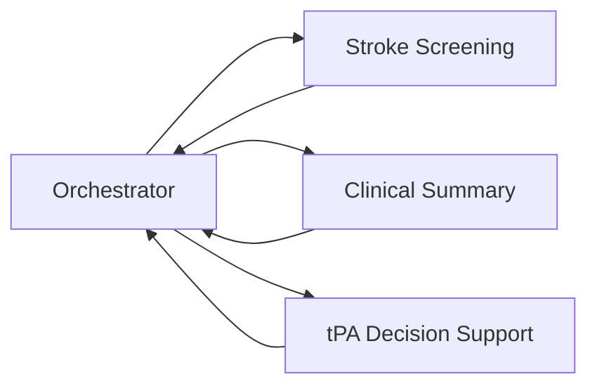

# CHAIN Agent Prototype

이 저장소는 뇌졸중 진료 지원을 위한 세 Agent를 한 Python 프로젝트에서 개발하고 실행하는 프로토타입입니다. 각 Agent는 맡은 작업을 처리해 결과를 돌려줍니다. 별도 프로그램인 Orchestrator가 업무 단계에 따라 Agent를 호출하고, 결과를 다음 단계에 전달합니다.

## 전체 구성



Agent끼리 직접 다음 Agent를 호출하지 않습니다. Orchestrator가 어떤 Agent를 언제 부를지 정하고 각 결과를 받습니다.

## Agent별 역할과 입출력

| Agent | 입력 | 내부 처리 | 반환 결과 |
|---|---|---|---|
| **Stroke Screening** | 뇌졸중 선별 기록과 구조화 정보 | 기록에서 근거를 찾고 prototype rule로 screening 결과를 만듭니다. Mock v0.12 경로에서는 로컬 LLM을 사용합니다. | 선별 결과, 발견 근거, 임상 시각, 추가 확인 정보 |
| **Clinical Summary** | 환자·내원 정보, 자료 목록, 답을 원하는 질문 | 구조화 자료는 코드가 처리하고, 문서 원문은 LLM이 질문별 사실과 인용을 찾습니다. | 질문별 `items`, 근거 인용, `missing_information` |
| **tPA Decision Support** | `interim` 또는 `final` 요청과 구조화된 임상 사실 | LLM 없이 결정론적 규칙과 수치 계산을 적용합니다. | `assessment`와 입력 근거를 보존한 `evidence_package` |

현재의 각 Agent는 독립적으로 호출할 수 있습니다. 통합 예제는 한 프로세스에서 세 Agent 결과를 함께 보여주지만, Screening 결과를 Summary 입력으로 자동 전달하는 순차 의료 workflow를 구성하지는 않습니다.

## 공통 호출 방법

각 Agent의 Python 진입점은 다음 모양입니다.

```python
invoke(request, snapshot, services) -> result
```

- `request`: 지금 어떤 작업을 할지와 필요한 질문을 전달합니다.
- `snapshot`: 호출 시점에 확정된 구조화 자료 묶음입니다. 요청 방식에 따라 비어 있을 수 있습니다.
- `services`: Agent가 자료 조회나 모델 실행에 사용할 기능입니다.
- `result`: Agent가 만든 결과 사전입니다.

실제 연결에서는 Orchestrator가 요청을 만들고, 실행 환경이 필요한 `services`를 준비해 Agent를 호출합니다. Agent는 결과를 돌려주며, 업무 단계 관리와 결과 저장·전달은 Orchestrator가 맡습니다.

## 실행해 보기

Python 3.11 이상, 저장소 루트에서 실행합니다.

### Agent별 합성 예제

```bash
python -m examples.run screening
python -m examples.run summary
python -m examples.run tpa
```

세 명령은 고정된 합성 입력을 사용하며 LLM 추론을 하지 않습니다. `summary`는 기존 `context` 호출을 확인하고, `tpa`는 `interim`과 `final`을 모두 실행합니다.

### 세 Agent 결과 한 번에 보기

```bash
python -m examples.run all
python -m examples.run_integrated
```

- `examples.run all`: Screening, Summary `context`, tPA `interim/final` 결과를 출력합니다.
- `examples.run_integrated`: Screening, Summary S1, tPA `interim/final`의 합성 결과를 한 JSON에 모아 출력합니다. 실제 LLM 추론이나 Agent 간 순차 전달은 하지 않습니다.

### 테스트

```bash
python -m unittest discover -s tests -v
```

테스트는 각 Agent의 입력 검증, 규칙, 결과 형식을 확인합니다. 현재 전체 테스트는 107개입니다.

## 실제 LLM을 사용한 GPU 실행

아래 Summary 명령은 로컬 모델 가중치가 준비된 환경에서 실행합니다. 모델 경로는 실제 저장 위치로 바꿉니다.

```bash
python -m examples.summary_s1 --model qwen35_9b --gpu 2 --model-dir /path/to/models/Qwen3.5-9B
python -m examples.summary_s1 --model gemma4_12b_it --gpu 3 --model-dir /path/to/models/gemma-4-12B-it
```

Screening의 Mock v0.12 입력과 실제 Qwen 모델을 함께 실행하려면 다음 명령을 사용합니다.

```bash
python scripts/screening_v012_demo.py --mode gpu --model qwen35_9b --gpu 2 --model-root /path/to/models --max-new-tokens 1800
```

`tPA`는 구조화된 입력에 규칙을 적용하므로 GPU나 LLM을 사용하지 않습니다. 실행 준비와 모델별 옵션은 각 Agent 안내에 있습니다.

## Orchestrator와 연결할 위치

Agent 호출은 이 저장소의 Python 함수에서 시작합니다.

| Agent | 진입점 | 실행에 전달할 기능 |
|---|---|---|
| Screening | `chain_agents.screening.agent.invoke` | `services.backend`; Mock v0.12 모델 경로는 `invoke_v012` |
| Summary | `chain_agents.summary.agent.invoke` | S1은 `data_api`와 `extractor`; 기존 `context`는 snapshot |
| tPA | `chain_agents.tpa.agent.invoke` | request와 snapshot facts; 별도 서비스 호출 없음 |

Summary S1의 `data_api.get(path)`는 요청한 자료를 읽고, `extractor.extract(documents, questions)`는 문서에서 질문별 사실과 인용을 찾습니다. 입력 변환과 서비스 준비는 Orchestrator를 실행하는 Host 쪽에서 합니다.

## v0.3과 Mock v0.12

두 숫자는 서로 다른 참고 자료에 붙은 버전 표기입니다. 이 저장소 전체나 모델의 버전은 아닙니다.

- **v0.3**은 별도 [Orchestrator 저장소](https://github.com/donggunseo/chain-orchestrator-v03)의 Agent 호출 예제 형식입니다.
- **Mock v0.12**는 공유받은 CHAIN Mock PDF와 코드 묶음의 버전입니다. 예시 업무 흐름과 자료 형식을 설명합니다.

그래서 저장소에는 서로 다른 두 호출 예제가 있습니다. Screening은 두 자료 형식을 모두 보여주고, Summary의 `context`는 Orchestrator starter 방식, Summary의 S1은 질문별 자료 조회 방식입니다. 두 Summary 경로는 서로 다른 입력을 받으며 연속된 두 단계가 아닙니다.

## Agent별 안내

- [Screening 역할, Mock 입력, 실행 방법](chain_agents/screening/README.md)
- [Summary의 S1 실행, LLM, 입력과 결과](chain_agents/summary/README.md)
- [tPA 규칙, 입력 사실, 출력 형식](chain_agents/tpa/README.md)
- [Orchestrator 호출 및 서비스 연결](docs/INTEGRATION.md)
- [각 Agent의 입력과 반환 예시](docs/CONTRACT.md)
