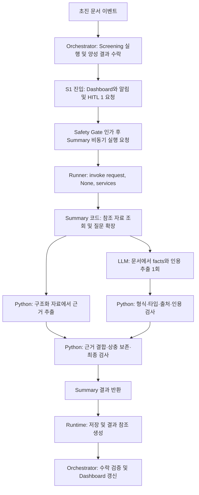

# S1 Summary: 요청부터 결과 검증·평가까지

기준일 2026-10-08. 확정 코드의 실제 동작과 Mock v0.12의 플랫폼 계획을 구분한다.
후속 HTTP 통합 구현은 [API_INTEGRATION.md](API_INTEGRATION.md)에 있다. 이 문서의 도메인 함수 위에
`api_service`가 동기/비동기 호출·SQLite 저장·조회·timeout을 추가하며 WG4/Event Bus는 여전히 플랫폼 영역이다.
입출력 규칙은 [S1_TYPED_SUMMARY.md](S1_TYPED_SUMMARY.md), 원안과 차이는 [MOCK_V012_ALIGNMENT.md](MOCK_V012_ALIGNMENT.md),
실제 JSON은 [S1_EXAMPLES.md](S1_EXAMPLES.md)를 함께 읽는다.

## 1. 전체 흐름과 소유권



A~D, L~M은 PDF의 플랫폼 계획이다. 현재 구현의 중심은 E~K다.
Python 호출은 동기적으로 반환한다. PDF의 `async`는 Runner가 Summary 완료를 기다리며 전체 워크플로를
막지 않도록 관리할 실행 방식이다. 두 GPU 실험 병렬화와는 다르다.
S1→S2 전이는 Summary 답이 아니라 HITL#1의 CT 진행 결정으로 이루어진다.

| 검증 위치 | 확인 사항 | 현재 구현 |
|---|---|---|
| Safety Gate / Runtime | 승인 Agent·모델, manifest, 토큰, 데이터 범위, 시간 제한 | Summary 밖의 연동 과제 |
| Summary 코드 | 요청/자료 결합, 출력 타입, 실제 근거, 상충 결과 | 구현 |
| Orchestrator EP4 | 외부 스키마, 정상 종료, 근거·confidence·생성시각 | PDF 요구; 현재 결과만으로 통과 보장 안 됨 |
| 오프라인 평가기 | GT 대비 답과 인용 정확도 | 구현; 운영 호출에 GT 없음 |
| 의료진 / HITL | 임상적 확인과 의사결정 | Agent가 대행하지 않음 |

## 2. 요청과 질문 확장

`agent.invoke`는 `input_references` 존재 여부로 분기한다. 참조형 요청이면 `logic.run`이
`history_s1_summary.run_history`를 호출한다. 기존 v0.3 snapshot 방식은 별도다.
원문 대신 환자·내원·episode ID, 참조 목록, 질문 ID를 받는다. `snapshot=None`이어야 한다.
`trigger.state_enter == S1`는 현재 검사하지 않는다. 중복 방지, 권한, S1 여부는 플랫폼에서 보장해야 한다.
결과에는 episode/encounter ID를 복사하지만 patient ID는 별도 필드로 반환하지 않는다.

| 받은 질문 | 최종 질문 | 이유 |
|---|---|---|
| `anticoagulant_use` | `anticoagulant_use`, `antiplatelet_use` | 원안 목적·출력에도 항혈소판제 포함 |
| `recent_surgery_or_bleeding` | `recent_surgery`, `recent_bleeding` | 수술과 출혈을 독립적으로 답하기 위해 |
| `previous_stroke` | 동일 | 환자 본인의 과거 병력 |
| `lkw_records` | 동일 | 현재 episode의 마지막 정상 확인 시각 |

질문은 자유로운 자연어가 아니라 고정 catalog ID다. LLM이 질문 유형을 임의로 정의하지 않는다.
HTTP 통합 작업에서 `resolve → requested_items`도 분리된 질문 ID를 허용하도록 맞췄다.
원래 alias와 `recent_surgery`, `recent_bleeding` 직접 요청 모두 지원한다.

## 3. 참조 자료 조회

`mock_contract.resolve()`가 요청 검증 후 각 참조를 `endpoint()`로 상대 GET 경로에 매핑하고
`services.summary_data_api.get(path)`를 호출한다. LLM이 API를 선택하거나 호출하지 않는다.
`FixtureDataAPI`는 합성 `GET 경로 → 응답 dict`에서 값을 읽는다. 실제 HTTP 연결은 새 `HTTPDataAPI`가 같은 get 인터페이스로 수행한다.

모든 리소스의 `patient_id`를 대조한다. 문서에는 document ID·정수 version·encounter ID,
종류(`ED_INITIAL_NOTE`, `ED_TRIAGE_NOTE`), 상태(`CURRENT`, `SUPERSEDED`), 문자열 text를 추가 검사한다.
명시한 이전 버전도 읽을 수 있으나 철회·미지원 상태는 거부한다. 중복 참조도 거부한다.

실행 토큰, manifest scope, 조회시점 일치, `as_of` 시간차 검사는 미구현이다.
`saved_time/as_of/provenance`를 조회 객체에서는 보존하지만 모두 최종 반환에 전사하지는 않는다.
문서 saved_time은 LLM에 제공한다. 구조화 record 내부 provenance는 evidence record 복사에 포함된다.

## 4. 코드와 LLM의 처리 분담

### 구조화 자료: `_structured_facts()`

| 자료 | 코드 처리 | 하지 않는 판단 |
|---|---|---|
| 활성 약물 | ACTIVE 행의 `drug_class_flags.anticoagulant/antiplatelet is True`에서 true fact 생성 | ATC/약명 재분류, 빈 목록·false flag 전체를 환자 비복용으로 변환 |
| 문제 목록 | PROBLEM_LIST이며 provisional/error/retracted 제외 후 `I6[0-9]`, `G45`, `Z86.73` 시작 코드를 과거력 true로 처리 | 전체 ontology/날짜 기반 판정, 현재 encounter diagnosis를 과거력으로 사용 |
| 최근 6개월 내원 | `window_months == 6`; current 내원 제외; `surgery is True` / `bleeding_event is True` 처리 | 타원 이력 없음 판단, procedure 자동 분류, false 행만으로 전역 부정 판단 |

flag 누락, 분류되지 않은 procedure, coverage 제한은 `missing_information`에 남긴다.
6개월은 조회 범위이며 치료 금기의 임상 기간을 정한 것이 아니다. 원안 API의 `derived` 값을 직접 최종 답으로 복사하지 않는다.

### 문서: `LocalS1Extractor.extract()`

실제 순서는 조회 → LLM 추출/검증 → 구조화 fact 생성 → 결합이다. 구조화 약물 목록을 LLM에 보내지 않는다.
문서가 없으면 LLM 없이 빈 payload로 시작한다. 문서가 있으면 **모든 문서와 모든 질문을 한 번에** 보낸다.
문서별 호출이나 두 단계 재질문은 없다.

## 5. LLM이 받는 입력

```python
messages = [
    {'role': 'system', 'content': DIRECT_PROMPT},
    {'role': 'user', 'content': json.dumps({'questions': catalog, 'documents': docs}, ensure_ascii=False)},
]
```

system은 고정 역할, 상태 규칙, boolean/time 형식, 인용 규칙과 금지된 판단을 설명한다.
user에는 질문별 `question/type/value_schema/scope/rules`와 문서별 `source_ref/saved_time/text`가 있다.
전체 request, GT, 구조화 API 응답은 보내지 않는다. 정확한 영어 catalog·prompt·실제 입력은 [예시](S1_EXAMPLES.md)에 있다.

`apply_chat_template`가 role과 내용을 모델 토큰 형식으로 바꾼다.
`model.generate(do_sample=False, max_new_tokens=8192, use_cache=True)`로 추론한다.
Qwen에만 `enable_thinking=False`를 명시한다. weights는 로컬에서 읽고 offline 환경변수를 설정한다.

**JSON key 자체도 LLM이 생성한다.** 코드가 빈 JSON의 값 칸만 채우도록 강제하는 grammar/constrained decoding은 없다.
따라서 key 누락이나 타입 오류가 발생할 수 있다. evidence_first 역시 JSON 생성 순서 변경이며 별도 인용 추출 호출이 아니다.

## 6. 후보 출력과 최종 결과

LLM top level은 정확히 `facts`, `reviewed_documents`다. 아래는 형식 설명용 합성 예시다.

```json
{
  "facts": [{
    "question": "anticoagulant_use",
    "status": "documented",
    "value": false,
    "evidence": [{"source_ref": "document:example@1", "quote": "현재 항응고제를 복용하지 않는다"}]
  }],
  "reviewed_documents": ["document:example@1"]
}
```

fact는 네 key다. 모델은 `documented`, `explicitly_unknown`, `not_stated`만 낼 수 있다.
상충하는 진술은 각각 fact로 내고 `conflicting`을 직접 결정하지 않는다. `alternatives`도 모델 출력에는 없다.
`reviewed_documents`에는 관련 내용 없는 문서도 포함해 모든 입력 문서를 한 번씩 적는다.
이는 목록 확인이며 실제로 빠짐없이 이해했다는 증명은 아니다.

## 7. 코드 검수 순서와 범위

1. 생성 토큰 수가 8192 이상이면 cap 도달로 거부한다. 잘린 응답을 성공으로 보정하지 않는다.
2. `_decode`는 `facts`가 있는 완결 JSON 객체를 찾아 마지막 것을 선택한다. 전체 raw가 JSON 하나뿐인지 강제하지 않는다. 특정 thought/final marker가 있으면 최종 부분을 분리하는 로직도 있다.
3. top level/fact의 정확한 key 집합을 검사한다. key 순서는 기록하되 그것만으로 거부하지 않는다.
4. `reviewed_documents`의 완전성·중복을 검사한다.
5. 질문 범위, 상태, documented 값의 타입을 검사한다. boolean은 실제 bool만 허용하며 0/1과 문자열은 거부한다.
6. unknown은 null과 근거 필수, not_stated는 null과 빈 근거 필수다. 모르는 값을 false로 대체하지 않는다.
7. 출처가 조회 문서인지, quote가 문서에 있는지 확인한다. **실제 검사는 NFKC·casefold·공백 제거 후 substring 검사**다. 프롬프트는 원문 복사를 요구하지만 바이트 동일성을 검사하지 않는다.
8. 시간값 key·kind·precision, ISO 파싱/timezone, endpoint 형식, 구간 시작≤종료를 확인한다. original_text가 인용 안에 있는지도 본다. 초 `:00` 표기는 프롬프트 규칙이고 parser는 Python ISO 허용 범위를 따른다.
9. 구조화 evidence는 원본 source의 record 목록에 같은 record가 있는지 검사한다.
10. 결합 후 최종 다섯 key, 질문당 한 item, status/value/evidence/alternatives 규칙을 다시 검사한다.

검증은 extractor와 run_history/finalize_facts에서 반복될 수 있지만 LLM 재호출은 아니다.
오류는 예외로 전파한다. 실험 runner는 failure와 result null을 기록한다. 운영 Runtime은 FAILED로 처리해야 한다.

### 의미 정확도는 별도다

문서에 quote가 존재해도 선택한 질문·값을 지지한다는 뜻은 아니다.
가족/본인, 부정, 과거/현재, LKW 날짜와 의미, 사건 동일성은 주로 모델이 판단한다.
“문진하지 않았다”를 `documented/false`로 내면 타입·quote 검사는 통과해도 GT 평가에서는 틀릴 수 있다.

## 8. 결합 규칙

`finalize_facts()`가 모델 facts와 구조화 facts를 질문별로 모은다.

1. documented 값이 있으면 canonical value별로 같은 근거를 합친다.
2. 서로 다른 documented 값 둘 이상이면 conflicting/null, 빈 parent evidence, 값별 alternatives를 만든다.
3. documented가 없고 unknown 진술이 있으면 explicitly_unknown으로 묶는다.
4. 둘 다 없으면 not_stated로 채운다. no-mention marker는 근거 있는 fact를 덮어쓰지 않는다.

시간은 kind/start/end/precision으로 비교하며 timezone은 UTC로 맞춘다. endpoint가 있으면 original_text 차이는 값 동등성에서 제외한다.
근사값과 정확한 값, 다른 precision은 같은 시계 시각이어도 별개 값이 될 수 있다.
“최신 기록 우선”이나 사건 범위 재판단은 코드에 없다. documented가 있으면 unknown 근거가 최종 item에서 빠질 수 있다.
`not_applicable`은 최종 validator에 예약됐지만 현재 모델/finalizer는 생성하지 않는다.

## 9. 반환·저장·재사용

items는 질문당 하나의 다섯-key 객체다. missing_information에는 미확인 상태와 자료 범위 제한을 적는다.
model_info는 rule_set, 내부 실행 tier, model_key, extraction_method, confidence 정책을 포함한다.
정확한 revision·패키지 버전은 반환 객체가 아닌 실험 metadata에 있다.

도메인 함수에는 DB 저장, result ID 발급, 조회 API가 없다. 새 `api_service`가 이 바깥에서 execution ID 발급,
SQLite 저장과 결과 조회 API를 제공한다. 기존 실험 runner도 별도로 data2에 요청·GT·raw·결과를 저장한다.
PDF에서는 Runtime이 실행 ID/시간/hash와 결과를 저장하고 result_ref를 만든 뒤 Orchestrator가 수락한다.
Dashboard와 후속 DSA는 그 결과를 조회한다. questions가 있을 때만 저장하는 구조가 아니며, 현재 질문 없는 요청은 허용하지 않는다.
현재는 API의 SQLite 저장소에서 나중에 결과를 다시 조회할 수 있다. JLK 중앙 저장소·Bus와 연결하는 것은 별도다.

## 10. 오프라인 평가

1. prepare가 8개 합성 사례·48개 GT를 저장한다. GT 후보를 코드로 결합해 예상 GT를 재현하는지 검사한다. 이는 계약 일관성 검사이며 의미 정답 증명은 아니다.
2. catalog, 두 prompt, source snapshot, runtime/model metadata와 hash를 기록한다. GT는 모델에 보내지 않는다.
3. Qwen GPU2, Gemma GPU3 worker가 동시에 실행된다. 각 모델 안에서 direct/evidence_first를 순서대로 실행한다.
4. runner는 `run_history`를 직접 호출한다. **Event Bus→S1 전이→invoke→Dashboard 통합 평가가 아니다.**
5. result/failure, raw, parsed payload, call count, token cap, 시간 등을 기록한다.
6. evaluator는 질문별 status와 canonical value를 GT와 비교한다. conflicting이면 alternative 값 집합을 비교한다. 항목 정확도는 전체 JSON 문자열 일치율이 아니다.
7. 인용 존재 여부와 GT evidence recall을 별도로 계산한다. recall은 같은 source_ref에서 정규화한 두 quote 중 하나가 다른 하나를 포함하면 일치로 본다. 짧은 정확한 근거도 정답이 될 수 있다.
8. result가 없는 사례는 6개 모두 0점이다. raw의 부분 정답에 점수를 주지 않는다. 인용 유효율은 성공 result의 evidence 기준이므로 전체 raw의 오류율과 다르다.

HTML에는 입력·GT·최종 JSON·거부된 parsed payload·raw·오류·생성 조건이 있다.
8개 합성 사례는 실제 병원 자료나 전체 workflow 성능 평가를 대체하지 않는다.
